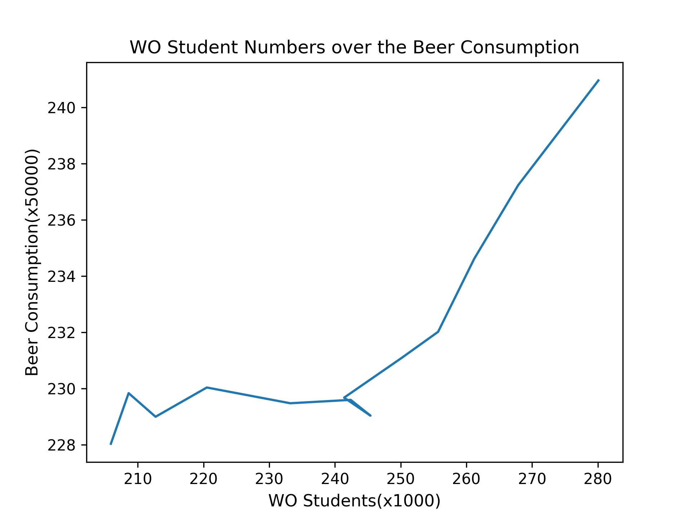

4. The title of the following papers pivotal to our knowledge:
- MCC Van Dyke et al., 2019
- JT Harvey, Applied Ergonomics, 2002
- DW Ziegler et al., 2005

  
*Figure1. WO Student Numbers over the Beer Consumption. This figure shows that the number of WO students showed a significant positive correlation with beer consumption over the years. The time span is from 2006 to 2018. In this figure, WO students count in thousands(x1000), while beer consumption counts in fifty thousands(x50000).*  
*Data Source: istherecorrelation.csv*